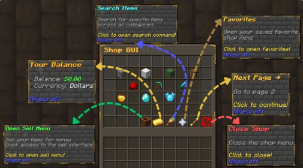
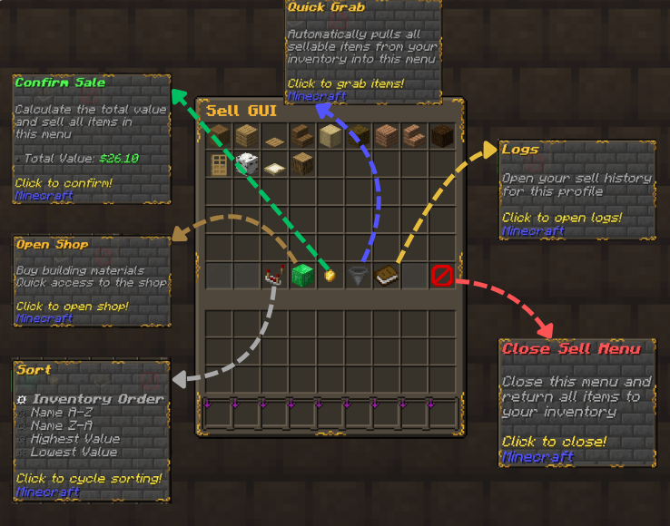
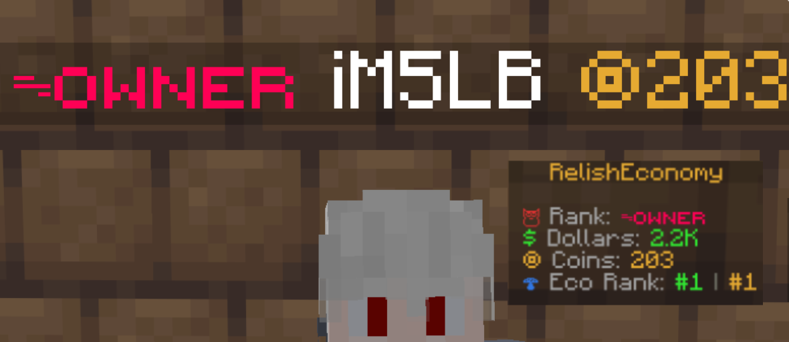

# RelishEconomy Documentation

## Quick Links

- [Installation](Installation.md)
- [Quick Start](QuickStart.md)
- [Configuration](Configuration.md)
- [Commands](Commands.md)
- [Shop System (Premium)](ShopSystem.md)
- [REST API](RestAPI.md)
- [PlaceholderAPI](PlaceholderAPI.md)
- [Permissions](Permissions.md)
- [Changelog](CHANGELOG.md)

## What's New (1.1.7-Beta)

- **⭐ Personal Vault (Premium)** — a password-protected physical currency chest. Right-click a Vault block to open. Enter your PIN on a click-based keypad (numbered player heads). Deposit physical currency items into the tray; use the `+/-` controls to withdraw them back. Vault sounds use Minecraft's native vault block audio.
- **HTTP REST API** — embedded API server (disabled by default) for Discord bots, web panels, and automation. Bearer-token auth, full balance CRUD, zero extra dependencies.
- **`AccountManager` external API** — `refreshAccountFromDatabase(UUID)` lets other plugins force an account reload after writing directly to the database.
- **Offline player tab completion** — `eco`, `balance`, and `logs` commands now suggest offline player names.
- **`eco clear` / `eco info`** — manage and inspect balances for offline players without touching the database.

## Screenshots

