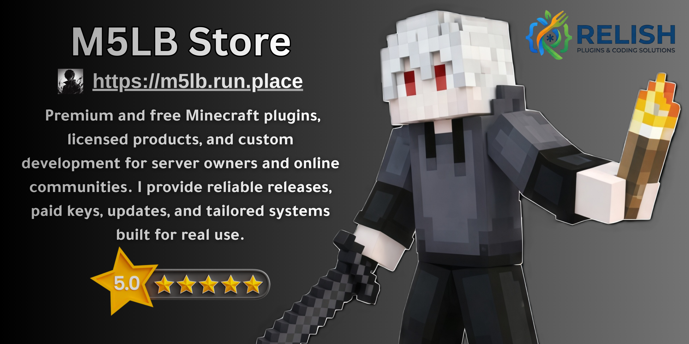
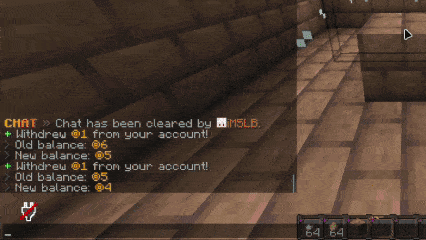
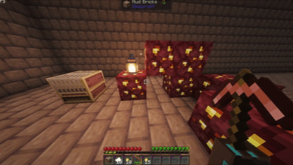

# RelishEconomy Documentation

Official documentation for **RelishEconomy** — multi-currency economy, shop, sell GUI, ATM, physical currency, and more for Paper 1.21+.

## What is RelishEconomy?

RelishEconomy is a modern economy plugin for Paper servers:

- Multiple currencies with symbols, colors, permissions, and exchange rates
- Vault economy provider for other plugins
- PlaceholderAPI balances, baltop, and stats
- Command selling (`/sellhand`, `/sellhotbar`, `/sellall`)
- Premium GUIs: shop, sell, ATM, transaction logs
- Physical currency, personal vault, natural-source conversion
- Storage: SQLite or MySQL

## Free and Premium

RelishEconomy ships as a **free** jar with core economy commands. A **license key** unlocks premium features (shop, sell GUI, ATM, physical currency, personal vault, and more).

See [Free vs Premium](FreeVsPremium.md) and set `license-key` in `config.yml`. Purchase keys at the [Relish Store](https://relishes.studio/product/relisheconomy).

## Quick Links

| Guide | Description |
|-------|-------------|
| [Installation](Installation.md) | Install and verify |
| [Quick Start](QuickStart.md) | First economy setup |
| [Free vs Premium](FreeVsPremium.md) | Feature gates and licensing |
| [Configuration](Configuration.md) | Config reference |
| [Currencies & Exchange](Currencies.md) | Multi-currency and exchange |
| [Shop System](ShopSystem.md) | Premium shop GUI |
| [Sell System](SellSystem.md) | Command sell and Sell GUI |
| [Physical Currency](PhysicalCurrency.md) | Notes, coins, natural sources |
| [ATM](ATM.md) | Deposit / withdraw GUI |
| [Personal Vault](PersonalVault.md) | Password-protected vault |
| [REST API](RestAPI.md) | HTTP API for bots and panels |
| [Commands](Commands.md) | Full command list |
| [Permissions](Permissions.md) | Permission nodes |
| [PlaceholderAPI](PlaceholderAPI.md) | Placeholders |
| [Changelog](CHANGELOG.md) | Version history |

## Requirements

| Component | Requirement |
|-----------|-------------|
| Minecraft | 1.21+ |
| Server | Paper, Purpur, or Paper-based forks |
| Java | 21+ |
| Soft dependencies | Vault (recommended), PlaceholderAPI (optional) |

## Screenshots

## Getting Help

- Store: [m5lb.run.place](https://relishes.studio/product/relisheconomy)
- Modrinth: [modrinth.com/plugin/relisheconomy](https://modrinth.com/plugin/relisheconomy)
- Discord: [Support server](https://discord.gg/AdUjAtCsy6)
- Donate: [creators.sa/m5lb](https://creators.sa/m5lb)

## Next Steps

1. [Install RelishEconomy](Installation.md)
2. [Quick Start](QuickStart.md)
3. [Configure](Configuration.md) and set permissions
4. Optionally add a [license key](FreeVsPremium.md) for premium features
