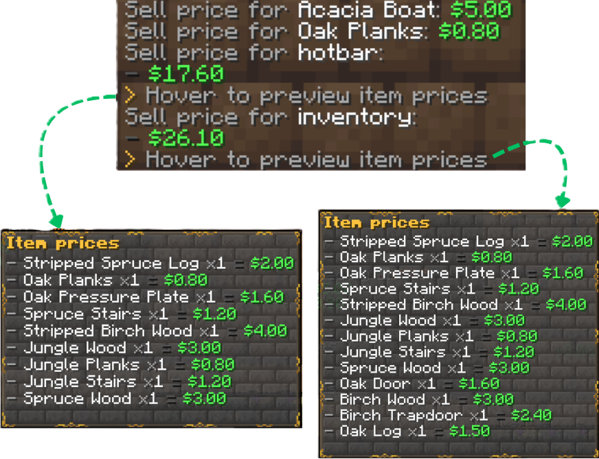

# Sell System

Sell items for currency using commands (free) or the Sell GUI / composter (Premium).


## Command Selling (Free)

| Command | Description |
|---------|-------------|
| `/sellhand` | Sell the item in your hand |
| `/sellhotbar` / `/sellhb` | Sell hotbar items |
| `/sellall [confirm]` | Sell all sellable inventory items |
| `/sell price <item\|@hand\|@hotbar\|@inv>` | Check sell value |

Prices come from `prices.yml`. Some sell outputs include hover breakdowns of what was sold.



## Sell GUI (Premium)

```text
/sell
```

Opens the drag-and-drop Sell GUI. Layout and sounds are in `gui.yml` under `sell-gui`.

You can also open it from a configured block:

```yaml
# config.yml
sell-gui-block: COMPOSTER
```

## Composter Selling (Premium)

When enabled, throwing sellable items onto a composter sells them:

```yaml
composter-selling:
  enabled: true
  cooldown: 500
```

## Pricing

Define sell prices in `prices.yml`:

```yaml
prices:
  DIAMOND: { price: 100.0, currency: "coins" }
  IRON_INGOT: 5.0
```

## Next Steps

- [Shop System](ShopSystem.md)
- [Configuration](Configuration.md)
- [Free vs Premium](FreeVsPremium.md)
- [Commands](Commands.md)
